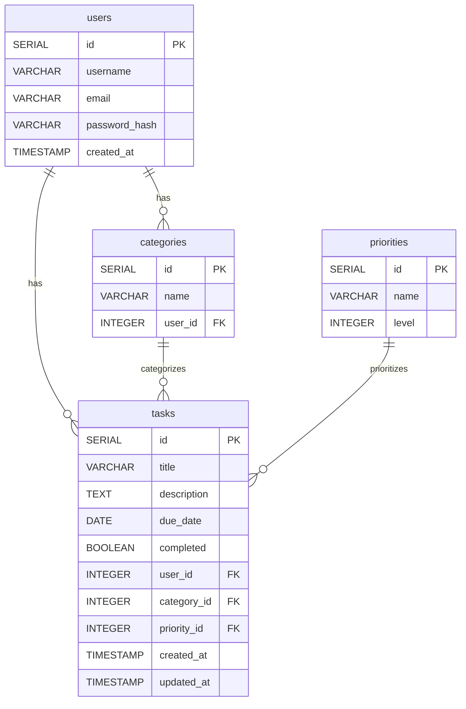

# PostgreSQL Database Schema Design

## users
- id SERIAL PRIMARY KEY
- username VARCHAR(50) UNIQUE NOT NULL
- email VARCHAR(100) UNIQUE NOT NULL
- password_hash VARCHAR(255) NOT NULL
- created_at TIMESTAMP DEFAULT CURRENT_TIMESTAMP

CREATE INDEX idx_users_username ON users(username);
CREATE INDEX idx_users_email ON users(email);

## categories
- id SERIAL PRIMARY KEY
- name VARCHAR(50) UNIQUE NOT NULL
- user_id INTEGER REFERENCES users(id) ON DELETE CASCADE

CREATE INDEX idx_categories_user_id ON categories(user_id);

## priorities
- id SERIAL PRIMARY KEY
- name VARCHAR(20) UNIQUE NOT NULL -- e.g., Low, Medium, High
- level INTEGER NOT NULL -- e.g., 1=Low, 2=Medium, 3=High

CREATE INDEX idx_priorities_level ON priorities(level);

## tasks
- id SERIAL PRIMARY KEY
- title VARCHAR(100) NOT NULL
- description TEXT
- due_date DATE
- completed BOOLEAN DEFAULT FALSE
- user_id INTEGER REFERENCES users(id) ON DELETE CASCADE
- category_id INTEGER REFERENCES categories(id) ON DELETE SET NULL
- priority_id INTEGER REFERENCES priorities(id) ON DELETE SET NULL
- created_at TIMESTAMP DEFAULT CURRENT_TIMESTAMP
- updated_at TIMESTAMP DEFAULT CURRENT_TIMESTAMP

CREATE INDEX idx_tasks_user_id ON tasks(user_id);
CREATE INDEX idx_tasks_category_id ON tasks(category_id);
CREATE INDEX idx_tasks_priority_id ON tasks(priority_id);
CREATE INDEX idx_tasks_due_date ON tasks(due_date);
CREATE INDEX idx_tasks_completed ON tasks(completed);

---

## Entity Relationship Diagram (Mermaid)

---

## ERD Description

This ERD (Entity Relationship Diagram) models the core entities and relationships for a collaborative task management system:

- **users**: Stores user account information. Each user can create multiple tasks and categories.
- **categories**: Represents categories for organizing tasks. Each category belongs to a user, and a user can have multiple categories.
- **priorities**: Defines priority levels (e.g., Low, Medium, High) that can be assigned to tasks.
- **tasks**: Stores individual tasks. Each task is created by a user, can belong to a category, and can have a priority. Tasks have due dates and completion status.

### Relationships
- A user can have many categories and many tasks.
- A category belongs to one user and can have many tasks.
- A priority can be assigned to many tasks.
- Each task is created by one user, can belong to one category, and can have one priority.

#### (Optional for multi-user assignment)
- If supporting task assignments to multiple users, a `task_assignments` table (not shown in the diagram) would map users to tasks, allowing many-to-many assignments.

This schema supports flexible task organization, prioritization, and user collaboration.